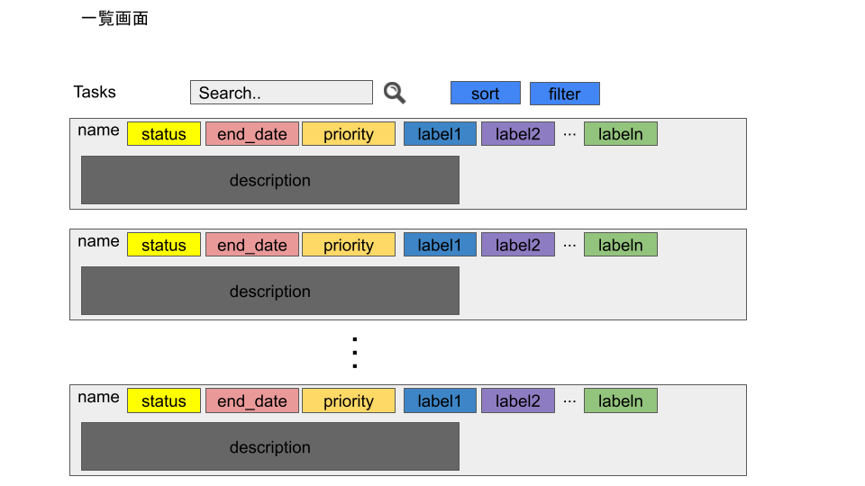
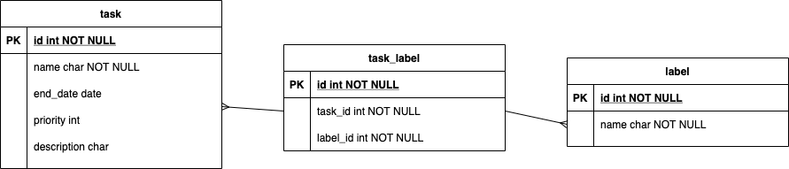

# data schema




## タスクテーブル
```
{
  id: int (not null unique),
  name: char(30) (not null),
  end_date: date,
  priority: int,
  description: char(300),
}
```

## ラベルテーブル
```
{
  id: int (not null unique),
  name: char(10) (not null),
}
```

## タスク-ラベルテーブル(中間テーブル)
```
{
  id: int (not null unique),
  task_id: int (not null),
  lebel_id: int (not null),
}
```
