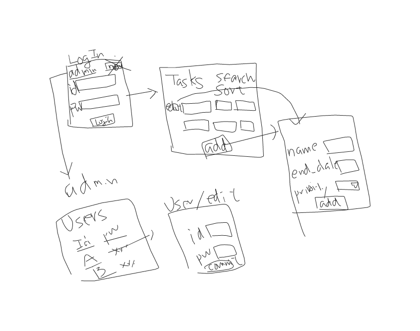

# Kanban in the future

## System Overview

## Data Structure

### tasks

| colmun name | type |
| :--- | :--- |
| name | string |
| description | text |
| priority | integer |
| status | integer |
| end_date | date |
| creator | integer |

### labels

| colmun name | type |
| :--- | :--- |
| name | string |

### task_labels

| colmun name | type |
| :--- | :--- |
| task_id | integer |
| label_id | integer |

### users

| colmun name | type |
| :--- | :--- |
| login_id | string |
| login_pw | string |
| name | string |