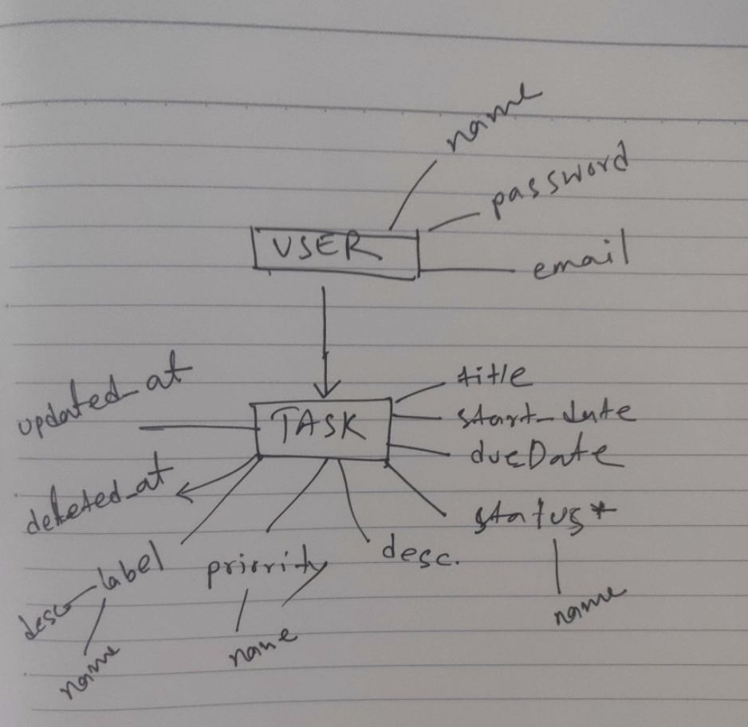

### Flow

### DB Schema

users
- id int(11) unsigned NOT NULL AUTO_INCREMENT
- name varchar(128) NOT NULL
- password varchar(128) NOT NULL
- email varchar(128) NOT NULL
- created_at datetime NOT NULL

tasks
- id int(11) unsigned NOT NULL AUTO_INCREMENT
- name varchar(255) NOT NULL
- description text NOT NULL
- status int(11) NOT NULL
- user_id int(11) NOT NULL
- label_id int(11) NOT NULL
- priority int(11) NOT NULL
- created_at datetime NOT NULL
- due_at datetime NOT NULL
- updated_at datetime NOT NULL
- deleted_at datetime NULL

labels
- id int(11) unsigned NOT NULL AUTO_INCREMENT
- name varchar(128) NOT NULL
- description varchar(128) NOT NULL