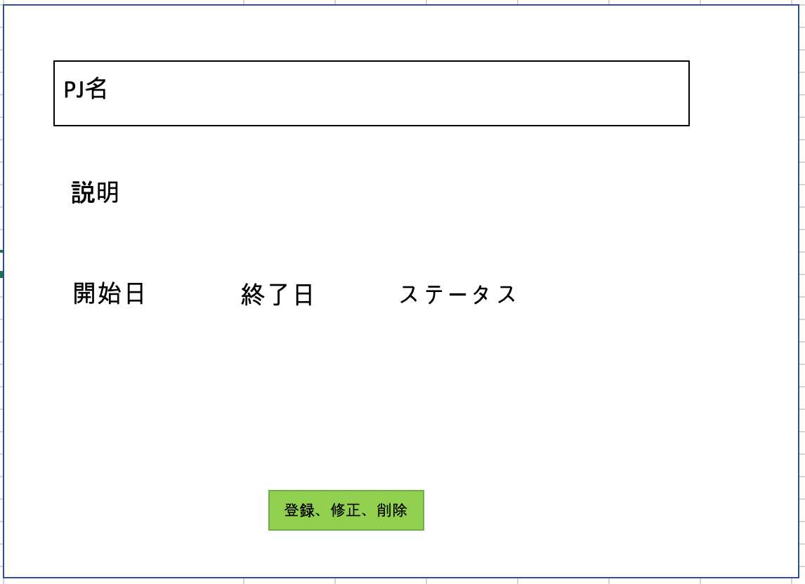
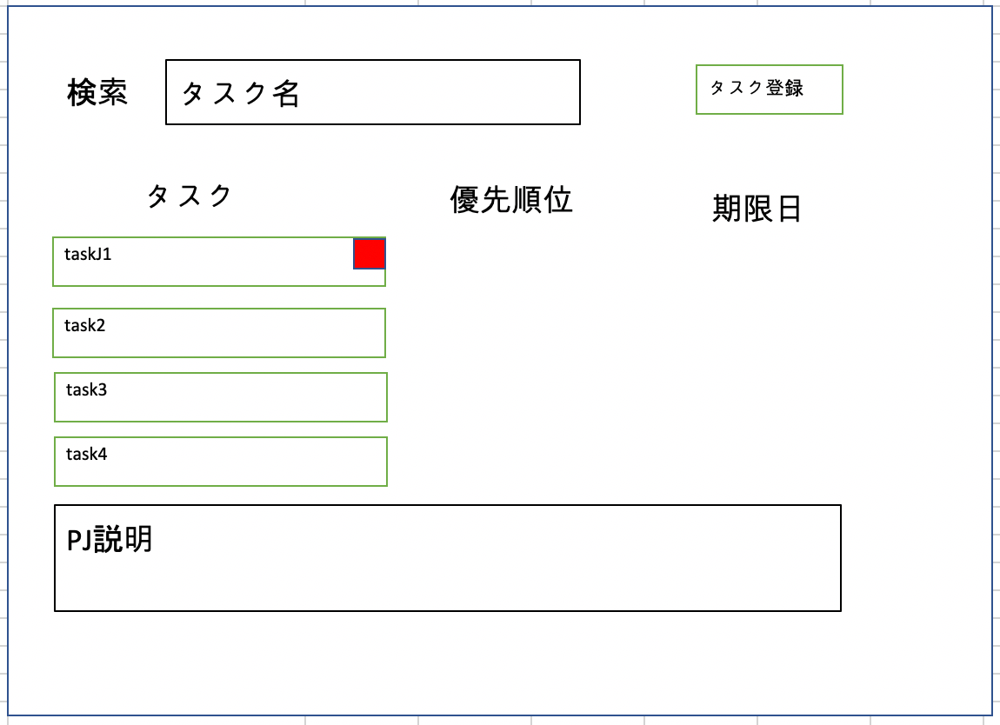

# README

##Database tables

users
|カラム名|名称|タイプ|制約|
|:---||:---||:---||:---|
|id|ユーザID|INT|primarykey|
|account_name|ユーザ名|VARCHAR||
|password|パスワード|VARCHAR||
|create_timestamp|作成タイムスタンプ|DATETIME||
|update_timestamp|更新タイムスタンプ|DATETIME||

projects
|カラム名|名称|タイプ|制約|
|:---||:---||:---||:---|
|id|プロジェクトID|INT|primarykey|
|project_name|プロジェクト名称|varchar||
|status|プロジェクトステータス|INT||
|description|説明|VARCHAR||
|start_timestamp|開始タイムスタンプ|DATETIME||
|end_timestamp|終了タイムスタンプ|DATETIME||
|create_timestamp|作成タイムスタンプ|DATETIME||
|update_timestamp|更新タイムスタンプ|DATETIME||

user_projects
|カラム名|名称|タイプ|制約|
|:---||:---||:---||:---|
|id|ユーザプロジェクトID|INT|primarykey|
|user_id|ユーザID|INT|foreigenkey|
|project_id|プロジェクトID|INT|foreigenkey|
|create_timestamp|作成タイムスタンプ|DATETIME||
|update_timestamp|更新タイムスタンプ|DATETIME||

tasks
|カラム名|名称|タイプ|制約|
|:---||:---||:---||:---|
|id|タスクID|INT|primarykey|
|task_name|タスク名|VARCHAR||
|project_id|プロジェクトID|INT|foreigenkey|
|prioperty|優先順位|INT||
|assignee_id|担当ユーザid|VARCHAR|foreigenkey|
|repoter_id|報告者ユーザid|VARCHAR|foreigenkey|
|description|説明|VARCHAR||
|start_timestamp|開始タイムスタンプ|DATETIME||
|end_timestamp|終了タイムスタンプ|DATETIME||
|create_timestamp|作成タイムスタンプ|DATETIME||
|update_timestamp|更新タイムスタンプ|DATETIME||

task_labels
|id|ラベルID|INT|primarykey|
|task_id|タスクID|VARCHAR|foreigenkey|
|color|ラベル色|VARCHAR||
|color_group|色グループ|VARCHAR||
|create_timestamp|作成タイムスタンプ|DATETIME||
|update_timestamp|更新タイムスタンプ|DATETIME||

##ERD

##画面

1.ログイン画面

2.ユーザ登録画面

3.PJ一覧画面(ログイン後初期画面)

4.PJ登録、修正、削除画面

5.タスク一覧画面(PJ選択時、遷移)

6.タスク登録、修正、削除画面

