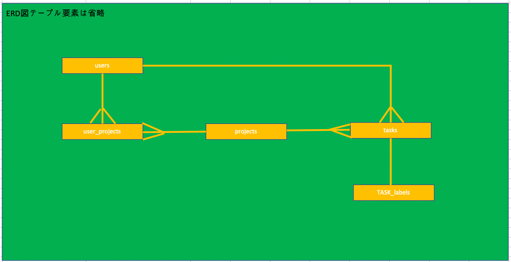
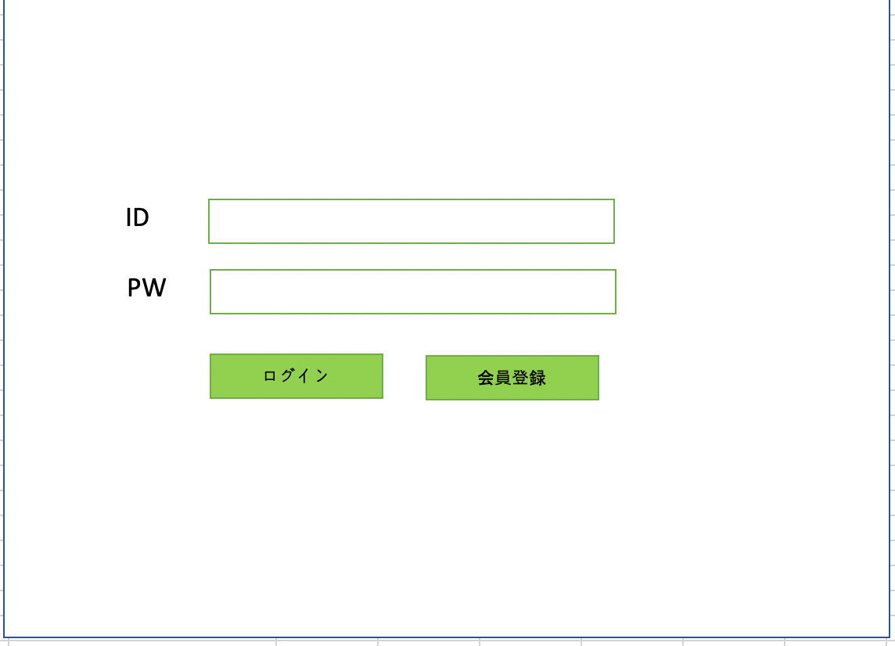
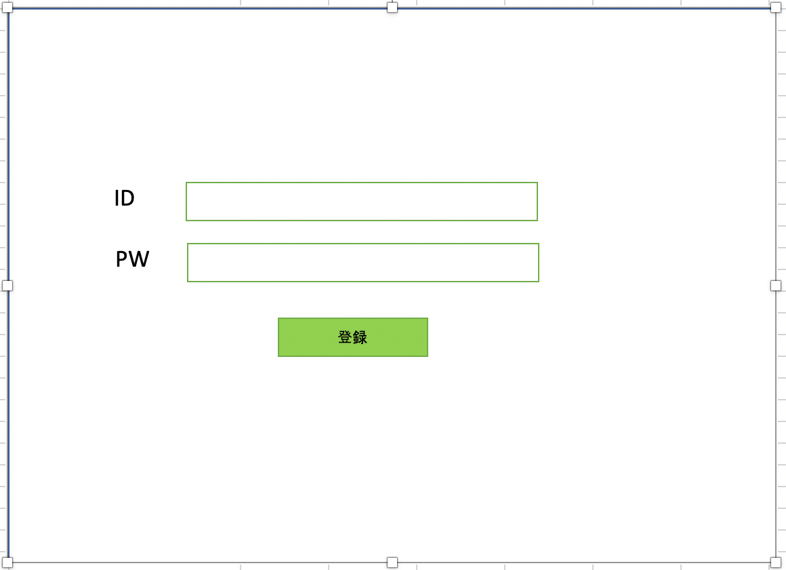
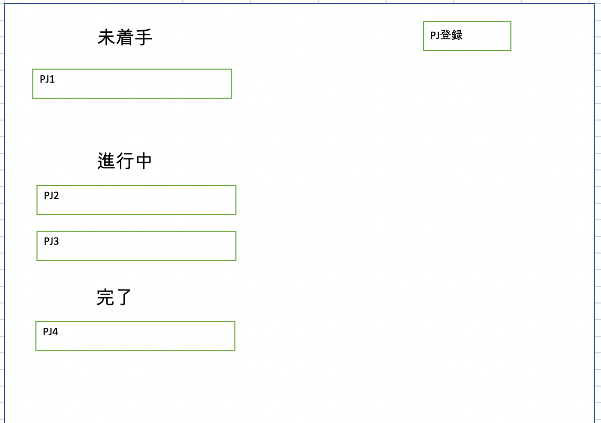
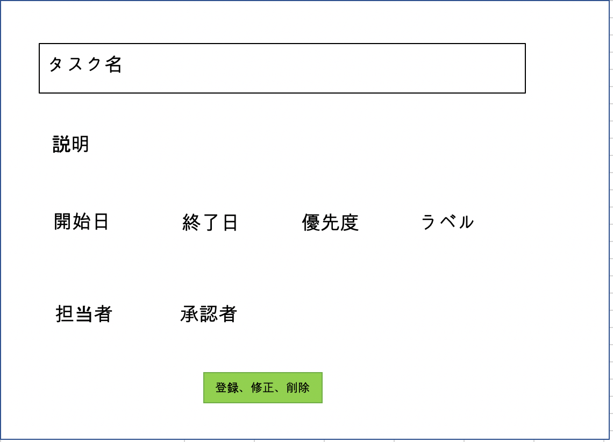

# README

## 環境設定方法
1. bundle install

`bundler insatll`

2. db設定

`rails db:migrate:reset`,

`rails db:seed`

3. server実行

`rails s`

## Database tables

users
| カラム名 | 名称 | タイプ | 制約 |
|:---|:---|:---|:---|
|id|ユーザID|INT|primarykey|
|account_name|ユーザ名|VARCHAR||
|password|パスワード|VARCHAR||
|created_at|作成タイムスタンプ|DATETIME||
|updated_at|更新タイムスタンプ|DATETIME||

projects
|カラム名|名称|タイプ|制約|
|:---|:---|:---|:---|
|id|プロジェクトID|INT|primarykey|
|project_name|プロジェクト名称|varchar||
|status|プロジェクトステータス|INT||
|description|説明|VARCHAR||
|started_at|開始タイムスタンプ|DATETIME||
|finished_at|終了タイムスタンプ|DATETIME||
|created_at|作成タイムスタンプ|DATETIME||
|updated_at|更新タイムスタンプ|DATETIME||

user_projects
|カラム名|名称|タイプ|制約|
|:---|:---|:---|:---|
|id|ユーザプロジェクトID|INT|primarykey|
|user_id|ユーザID|INT|foreignkey|
|project_id|プロジェクトID|INT|foreignkey|
|created_at|作成タイムスタンプ|DATETIME||
|updated_at|更新タイムスタンプ|DATETIME||

tasks
|カラム名|名称|タイプ|制約|
|:---|:---|:---|:---|
|id|タスクID|INT|primarykey|
|task_name|タスク名|VARCHAR||
|project_id|プロジェクトID|INT|foreignkey|
|priority|優先順位|INT||
|assignee_id|担当ユーザid|INT|foreignkey|
|assignee_name|担当ユーザ名|VARCHAR||
|reporter_id|報告者ユーザid|INT|foreignkey|
|reporter_name|報告者ユーザ名|VARCHAR||
|description|説明|VARCHAR||
|started_at|開始タイムスタンプ|DATETIME||
|finished_at|終了タイムスタンプ|DATETIME||
|created_at|作成タイムスタンプ|DATETIME||
|updated_at|更新タイムスタンプ|DATETIME||

task_labels
|カラム名|名称|タイプ|制約|
|:---|:---|:---|:---|
|id|ラベルID|INT|primarykey|
|task_id|タスクID|VARCHAR|foreignkey|
|color|ラベル色|VARCHAR||
|color_group|色グループ|VARCHAR||
|created_at|作成タイムスタンプ|DATETIME||
|updated_at|更新タイムスタンプ|DATETIME||

## ERD

## 画面

1.ログイン画面

2.ユーザ登録画面

3.PJ一覧画面(ログイン後初期画面)

4.PJ登録、修正、削除画面

5.タスク一覧画面(PJ選択時、遷移)

6.タスク登録、修正、削除画面

